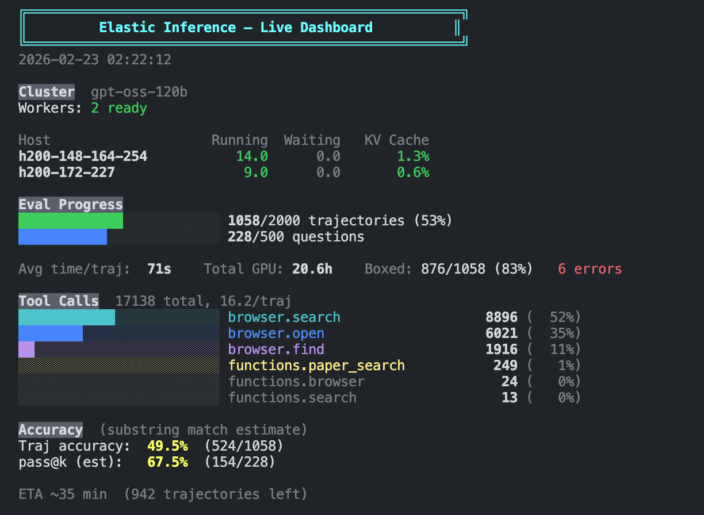

# Elastic Inference

Run vLLM/SGLang inference servers elastically on low-priority SLURM resources, with built-in deep research agent tools (web search, paper search, PubMed).

## Architecture

```
┌──────────────────────────────────────────────────────────────────┐
│  Scheduler  (login node, no GPU)                                 │
│                                                                  │
│  ┌─────────────┐  ┌──────────────┐  ┌────────────────────────┐  │
│  │ Node        │  │ Health       │  │ OpenAI-compatible      │  │
│  │ Acquirer    │  │ Monitor      │  │ Proxy (/v1/...)        │  │
│  │ (sbatch     │  │ (heartbeat   │  │ (round-robin across    │  │
│  │  greedy)    │  │  timeout →   │  │  all ready workers)    │  │
│  │             │  │  replace)    │  │                        │  │
│  └─────────────┘  └──────────────┘  └────────────────────────┘  │
└───────────────────────────┬──────────────────────────────────────┘
                            │ HTTP
        ┌───────────────────┼───────────────────┐
        ▼                   ▼                   ▼
┌──────────────┐   ┌──────────────┐   ┌──────────────┐
│ Node 0       │   │ Node 1       │   │ Node N       │
│ 8× H200 GPU  │   │ 8× H200 GPU  │   │ 8× H200 GPU  │
│              │   │              │   │              │
│ DP0: vLLM    │   │ DP0: vLLM    │   │ DP0: vLLM    │
│  (GPU 0-3)   │   │  (GPU 0-3)   │   │  (GPU 0-3)   │
│ DP1: vLLM    │   │ DP1: vLLM    │   │ DP1: vLLM    │
│  (GPU 4-7)   │   │  (GPU 4-7)   │   │  (GPU 4-7)   │
└──────────────┘   └──────────────┘   └──────────────┘
     TP=4, DP=2 per node (configurable)
```

A background thread continuously `sbatch`es up to `max_nodes`. Each SLURM job launches vLLM/SGLang instances with disjoint GPU slices, registers with the scheduler, and sends heartbeats. Preempted nodes are detected and replaced automatically. Clients see a single OpenAI-compatible endpoint.

## Quick Start

```bash
# Start scheduler — auto-acquires up to 2 H200 nodes on low priority
python -m elastic_serving.scheduler \
    --model /path/to/model \
    --tensor-parallel-size 8 --max-nodes 2

# Use from Python
from openai import OpenAI
client = OpenAI(base_url="http://SCHEDULER_HOST:8780/v1", api_key="EMPTY")
resp = client.chat.completions.create(
    model="/path/to/model",
    messages=[{"role": "user", "content": "Hello!"}],
)

# Check cluster status
python -m elastic_serving.client status
```

## Deep Research Agent

Built-in agentic tool-use framework using the model's native Harmony token format (`builtin_tools=["browser"]`). The agent can search the web, read pages, search academic papers, and query biomedical literature — all via tool calls within a single generation loop.

### Tools

| Tool | Backend | Namespace | Use for |
|------|---------|-----------|---------|
| `browser.search` | Serper | built-in | Web search |
| `browser.open` | Jina Reader | built-in | Read web pages |
| `browser.find` | local | built-in | Find text in opened page |
| `paper_search` | Semantic Scholar | custom | Academic papers (metadata or body snippets) |
| `pubmed_search` | PubMed/NCBI | custom | Biomedical literature |

See [`elastic_serving/dr_utils/README.md`](elastic_serving/dr_utils/README.md) for detailed tool reference.

### Interactive Chat

```bash
# Chat with tool use
python scripts/chat.py --scheduler-url http://localhost:8780

# With verbose mode (shows token counts, timing)
python scripts/chat.py --verbose --max-tool-calls 20
```

### Evaluation (WebShaper)

```bash
# Set API keys
echo "SERPER_API_KEY=..." >> .env
echo "JINA_API_KEY=..." >> .env
echo "S2_API_KEY=..." >> .env

# Test with 1 question
python scripts/eval_webshaper.py --num-samples 1 --num-trajectories 1

# Full eval: 500 questions × 4 trajectories, pass@4 with LLM judge
python scripts/eval_webshaper.py \
    --num-samples 500 --num-trajectories 4 \
    --max-tool-calls 50 --concurrency 8
```

### Evaluation (Miro Mode)

`eval_generic.py` can also run a Miro-style message-based loop over
`/v1/chat/completions`, with `keep_tool_result` trimming and Miro-compatible
tool names.

```bash
python scripts/eval_generic.py \
    --scheduler-url http://localhost:8780 \
    --dataset rl-rag/bc_synthetic_v_2 --split normal \
    --output-dir results/miro_generic \
    --agent-style miro \
    --max-tool-calls 50 \
    --enable-python
```

Useful Miro-specific arguments:

- `--agent-style miro` switches `eval_generic.py` from the native raw-prompt loop to the Miro message-based loop.
- `--max-tool-calls` is reused as the Miro turn budget.
- `--max-gen-tokens` controls the per-call generation cap; in Miro mode it defaults to `16384`.
- `--temperature` controls sampling; in Miro mode it defaults to `1.0`.
- `--miro-keep-tool-result` controls message-history trimming for tool outputs. The Miro runtime keeps the full assistant/user turn structure, but can replace older tool-result payloads with a short placeholder to save context length. `-1` keeps all prior tool-result content, `0` drops all prior tool-result payloads, and positive values keep only the last `K` tool-result messages verbatim.
- `--miro-no-final-summary` disables the extra final summary round that asks the model to synthesize the final boxed answer from the full trajectory.
- `--miro-no-web-summary-llm` disables the webpage-summary LLM inside `scrape_and_extract_info`. By default, that tool first scrapes the page/PDF and then calls `SUMMARY_LLM_*` with the current question or target instruction to extract the most relevant information. Disabling it returns the raw scraped content to the main model instead.
- `--enable-python` exposes the Miro `tool-python` tools backed by E2B; by default Python tools are disabled.
- `--skip-judge` saves trajectories only and skips answer judging; datasets without an `answer` column also skip judging automatically.

Defaults in Miro mode:

- `--max-tool-calls` is reused as the Miro turn budget
- `--miro-keep-tool-result -1` keeps all prior tool-result context; smaller values trade accuracy for lower prompt growth on long trajectories
- Miro sampling matches the native defaults: `max_gen_tokens=16384`, `temperature=1.0`, `top_p=0.95`, `repetition_penalty=1.05`
- final summary is enabled by default; pass `--miro-no-final-summary` to skip the extra summary round
- web summary LLM is enabled by default; pass `--miro-no-web-summary-llm` to return raw scraped content instead of question-aware extracted notes

Environment variables used by Miro mode:

- Required for search:
  `SERPER_API_KEY`
- Optional search endpoint override:
  `SERPER_BASE_URL`
- Required for scraping:
  `JINA_API_KEY`
- Optional scraping endpoint override:
  `JINA_BASE_URL`
- Required for webpage-summary LLM unless `--miro-no-web-summary-llm` is used:
  `SUMMARY_LLM_BASE_URL`, `SUMMARY_LLM_MODEL_NAME`, `SUMMARY_LLM_API_KEY`
- Required for `tool-python` when `--enable-python` is used:
  `E2B_API_KEY`
- Required only when answer judging is enabled:
  `OPENAI_API_KEY`

Current runtime defaults used by the Miro backend:

- `max_context_length = 131072`
- `DEFAULT_MAX_FINAL_ANSWER_RETRIES = 3`
- `DEFAULT_E2B_TIMEOUT = 600`
- `DEFAULT_E2B_TEMPLATE_ID = 1av7fdjfvcparqo8efq6`
- Older tool results are replaced with the literal placeholder `Tool result is omitted to save tokens.` when `--miro-keep-tool-result` trims history

### Trajectory Generation

```bash
python scripts/generate_trajectories.py \
    --dataset sample --num-samples 5 --max-tool-calls 15
```

## Parallelism: DP + TP

Each node gets 8 GPUs exclusively and runs `gpus_per_node / tp_size` independent server instances:

| TP | DP/node | 16 nodes total |
|----|---------|----------------|
| 1  | 8       | 128 workers    |
| 4  | 2       | 32 workers     |
| 8  | 1       | 16 workers     |

vLLM prefix caching is enabled by default for efficient multi-round agentic conversations.

## Configuration

```bash
python -m elastic_serving.scheduler \
    --model /path/to/model \
    --engine vllm \
    --qos h200_lowest --partition h200 --account dream \
    --max-nodes 16 --tensor-parallel-size 4 \
    --conda-env rl_verl --port 8780
```

Or load from JSON: `--config config.json`.

## Dashboard

Live monitoring of cluster status and eval job progress:

```bash
python scripts/dashboard.py                  # auto-refresh with colors
python scripts/dashboard.py --once           # print once
python scripts/dashboard.py --interval 5     # faster refresh
```



## Project Structure

```
elastic_serving/
├── scheduler.py          # FastAPI scheduler + SLURM acquirer + OpenAI proxy
├── worker.py             # Per-node daemon: starts DP vLLM/SGLang instances
├── client.py             # CLI + Python client helpers
├── config.py             # Data models and SchedulerConfig
├── tools.py              # Harmony format parsing, prompt building, re-exports
└── dr_utils/             # Deep research tools and prompts
    ├── tools.py           # BrowserSession, paper_search, pubmed_search
    ├── prompts.py         # System prompt, model identity
    └── README.md          # Tool reference
scripts/
├── chat.py               # Interactive CLI chat with tool use
├── eval_webshaper.py     # WebShaper evaluation (pass@k with LLM judge)
├── generate_trajectories.py  # Trajectory generation
├── test_load.py          # Load testing
└── launch_scheduler.sh   # Shell launcher
tests/
├── test_tools.py         # Tool integration tests
└── test_prefix_caching.py  # Prefix caching benchmark
```

## Install

```bash
pip install -e ".[client]"   # for openai client helper
# vllm/sglang should already be in your conda env
```
